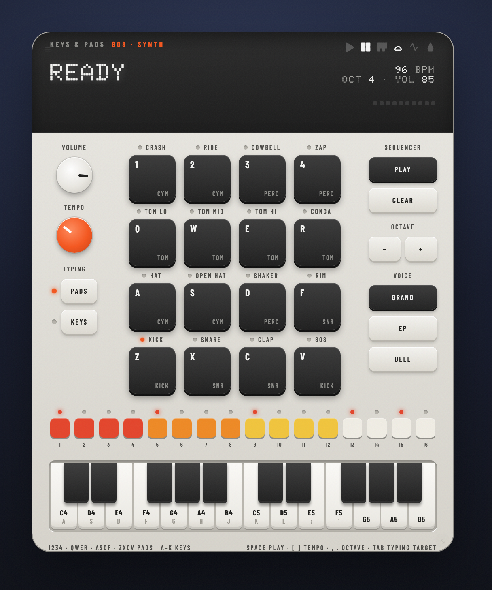

# keys-and-pads

> A playable 16-pad drum machine with a 16-step sequencer and a two-octave piano, synthesized entirely in the widget.

[](https://github.com/jke48222/keys-and-pads-widget/releases/latest) [](LICENSE) 

[Übersicht gallery](https://tracesof.net/uebersicht-widgets/) · [Widget suite](https://github.com/jke48222/widget-suite) · [Download](https://github.com/jke48222/keys-and-pads-widget/releases/latest) · [Setup guide](docs/SETUP.md) · [Troubleshooting](docs/TROUBLESHOOTING.md)

A widget for [Übersicht](http://tracesof.net/uebersicht/), self-contained in
`index.jsx`. It is built like a small hardware sampler: a light-grey slab with
a charcoal display band and dot-matrix readout, sixteen black pads with white
legends and printed labels, a volume knob and an orange tempo knob you drag,
a row of step keys in the TR-808's four colours, and two octaves of mini keys.
Every sound is synthesized with Web Audio the moment you play it:
an 808-style kit (kick, snare, clap, closed and open hat, rim, three toms, conga,
cowbell, shaker, crash, ride, a zap, and an 808 bass), a step sequencer that runs
on the audio clock, and three keyboard voices: **Grand** (additive partials with
real piano inharmonicity and stretched tuning), **EP** (two-operator FM in the
DX7 tradition), and **Bell**. No samples, no helper process, nothing leaves the
machine. Patterns, tempo, octave, and voice persist between refreshes.



## Requirements

- macOS with [Übersicht](https://tracesof.net/uebersicht/) installed (`brew install --cask ubersicht`)
- An interaction shortcut set in Übersicht's preferences (General → Interaction), so the widget can receive clicks and keys while interaction mode is on
- Sound output; the widget makes its own audio

## Install

If you don't have Übersicht yet:

```sh
brew install --cask ubersicht
```

**One-click.** Clone the repo and run the installer. It copies the widget into Übersicht's widgets folder, installs any helper scripts, and runs setup if the widget needs it. Safe to re-run.

```sh
git clone https://github.com/jke48222/keys-and-pads-widget.git
cd keys-and-pads-widget && ./install.sh
```

**Manual.** Download `keys-and-pads.widget.zip` from the [latest release](https://github.com/jke48222/keys-and-pads-widget/releases/latest), unzip it, and put the `keys-and-pads.widget` folder in `~/Library/Application Support/Übersicht/widgets/`. Then refresh Übersicht (menu bar icon → Refresh All).

Blank widget? Run `./check.sh` for a pass/fail diagnosis, or see [docs/TROUBLESHOOTING.md](docs/TROUBLESHOOTING.md).

## Playing it

Übersicht draws widgets behind your windows and passes clicks through to the
desktop. Turn on **interaction mode** (the shortcut from Übersicht's preferences,
or the menu bar icon) and the widget comes forward and takes input. Turn it off
to get your desktop back.

- **Pads.** Click a pad, or type its key. Where you click sets the velocity:
  soft near the top, hard near the bottom. The LED and a ripple confirm the hit.
- **Keys.** Click or drag across the piano (dragging plays a glissando), or type
  the letters printed on the white keys. The typing target follows the
  Pads / Keys switch at the top right (Tab flips it).
- **Sequencer.** Select a pad, then click steps in the 16-step row to toggle
  them. Space plays and stops, `[` and `]` change tempo, `clr` clears the
  selected pad's steps. A basic beat is loaded on first run.

| Keys | What they do |
| --- | --- |
| `1 2 3 4` / `Q W E R` / `A S D F` / `Z X C V` | the four rows of pads, top to bottom |
| `A W S E D F T G Y H U J K O L P ; '` | C up to F over one octave, piano layout |
| `,` `.` | octave down / up |
| `[` `]` | tempo down / up |
| `space` | play / stop the sequencer |
| `tab` | switch whether typing plays pads or keys |

## How the sounds are made

The drums follow the classic analog recipes: the kick is a sine whose pitch
falls from 150 Hz to 48 Hz in 50 ms under a 450 ms decay, the snare layers a
short triangle body with band-passed noise, the hats run six square-wave
partials at the TR-808 ratios through a 10 kHz band-pass and a 7 kHz high-pass,
the clap is three noise bursts 11 ms apart plus a tail, and the cowbell is the
808's 587 Hz and 845 Hz squares. The Grand voice sums up to nine partials at
`f·n·√(1 + B·n²)`, each with its own decay, so higher partials die first and
low notes ring longer, with a short band-passed hammer burst on the attack.
Everything runs through a gentle compressor and a synthesized convolution reverb.

## Customization

- Drum recipes live in `Engine` near the top of `index.jsx`; each is a few lines of Web Audio.
- The pad grid order, key maps, default pattern, and card size are constants above the component.
- All visual styling (colors, fonts, the card shell, pad and key materials) is in the inlined design-system block at the top of `index.jsx`.

## Bundled files

- `keys-and-pads.widget/index.jsx` — the widget, engine included
- `keys-and-pads.widget/fonts/` — Doto (display) and Barlow Condensed (labels), SIL Open Font License, see `fonts/OFL.txt`
- `install.sh` / `install.command` — one-click installer (copies the widget into Übersicht and installs any helpers)
- `check.sh` — read-only setup diagnostics; prints pass/fail per item

## Related widgets

Part of the [Übersicht Widget Suite](https://github.com/jke48222/widget-suite): 16 widgets that share one design system.

- [Animated Wallpaper](https://github.com/jke48222/animated-wallpaper-widget)
- [Clipboard History](https://github.com/jke48222/clipboard-history-widget)
- [Daily AI Prompt](https://github.com/jke48222/daily-ai-prompt-widget)
- [Daily Astronomy Photo](https://github.com/jke48222/daily-astronomy-photo-widget)
- [Daily Tarot](https://github.com/jke48222/daily-tarot-widget)
- [GitHub Contributions](https://github.com/jke48222/github-contributions-widget)
- [Now Playing](https://github.com/jke48222/now-playing-widget)
- [Recent Album Covers](https://github.com/jke48222/recent-album-covers-widget)
- [Recent Downloads](https://github.com/jke48222/recent-downloads-widget)
- [Rotating 3D Model](https://github.com/jke48222/rotating-3d-model-widget)
- [Spinning Globe](https://github.com/jke48222/spinning-globe-widget)
- [Wallpaper Switcher](https://github.com/jke48222/wallpaper-switcher-widget)
- [Agent Fleet](https://github.com/jke48222/agent-fleet-widget)
- [Pi Fleet](https://github.com/jke48222/pi-fleet-widget)
- [Window Pet](https://github.com/jke48222/window-pet-widget)

## License

MIT. See [LICENSE](LICENSE).

## Author

Jalen Edusei <jalen.edusei@gmail.com>
